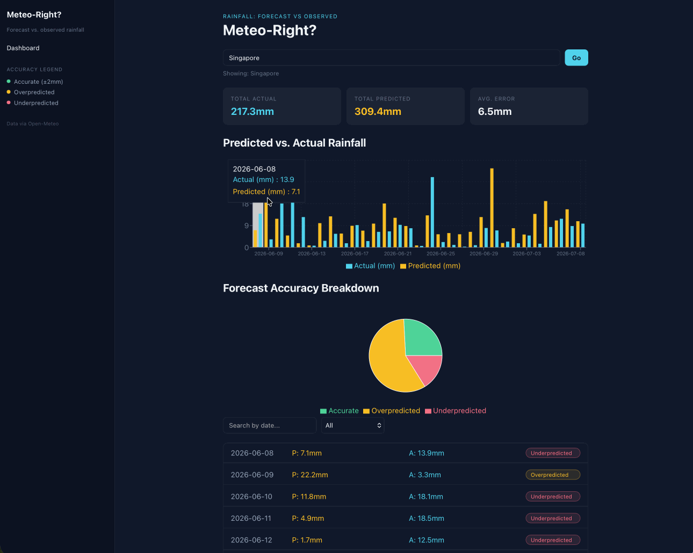
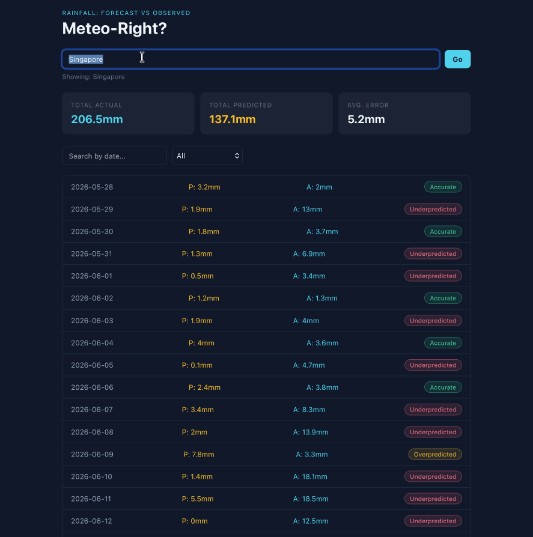

# Web Development Project 6 - *Meteo-Right? Ver. 2*

Submitted by: **Jason Ames**

This web app: **Meteo-Right? compares Open-Meteo's rainfall forecasts (issued a fixed number of days in advance) against what actually fell, letting users search any city, filter by forecast accuracy and search by date, and see at a glance whether the model over- or under-predicted rain.**

Time spent: **4** hours spent in total

## Required Features

The following **required** functionality is completed:

- [X] **Clicking on an item in the list view displays more details about it**
  - Clicking on an item in the dashboard list navigates to a detail view for that item
  - Detail view includes extra information about the item not included in the dashboard view
  - The same sidebar is displayed in detail view as in dashboard view
  - *To ensure an accurate grade, your sidebar **must** be viewable when showing the details view in your recording.*
- [X] **Each detail view of an item has a direct, unique URL link to that item’s detail view page**
  -  *To ensure an accurate grade, the URL/address bar of your web browser **must** be viewable in your recording.*
- [X] **The app includes at least two unique charts developed using the fetched data that tell an interesting story**
  - At least two charts should be incorporated into the dashboard view of the site
  - Each chart should describe a different aspect of the dataset

The following **optional** features are implemented:

- [ ] The site’s customized dashboard contains more content that explains what is interesting about the data 
  - e.g., an additional description, graph annotation, suggestion for which filters to use, or an additional page that explains more about the data
- [ ] The site allows users to toggle between different data visualizations
  - User should be able to use some mechanism to toggle between displaying and hiding visualizations 

  
The following **additional** features are implemented:

* A shared sidebar (persistent across all pages) with navigation, a color-coded accuracy legend, and data attribution
* Clicking a row's colors/badges carries through consistently across the dashboard, detail view, sidebar legend, and both charts — one visual language for "predicted" (amber), "actual" (cyan), and each accuracy category, rather than each part of the UI inventing its own colors
* The detail view fetches its own data independently by date and location (via URL query parameters), so each day's link is genuinely shareable/bookmarkable on its own, without requiring a prior visit to the dashboard
* Predicted rainfall API calls were optimized to request only the exact date range needed (via `start_date`/`end_date`) rather than a wider rolling window, notably speeding up the detail view

## Video Walkthrough

Here's a walkthrough of implemented user stories:

<!-- Replace this with whatever GIF tool you used! -->
GIF created with LICEcap  
<!-- Recommended tools:
[Kap](https://getkap.co/) for macOS
[ScreenToGif](https://www.screentogif.com/) for Windows
[peek](https://github.com/phw/peek) for Linux. -->

## Notes

Describe any challenges encountered while building the app.

- Migrating from a single `App.jsx` to React Router's page structure required moving state and logic into `Dashboard.jsx`, which meant every relative import path (`./api/openMeteo` → `../api/openMeteo`) needed updating too — a reminder that moving a file changes its relationship to everything it imports, not just its own contents.
- The detail view initially reused the dashboard's fetch pattern (computing "days back from today"), but that only works if you already know *today's* offset from the target date. Realized the detail page needed to accept location as URL query parameters (`?lat=...&lon=...&name=...`), not just the date as a path parameter — otherwise a direct/shared link to a detail page would have no way of knowing which location's data to fetch.
- Wrapping each list row in a `<Link>` broke the existing column layout, since `justify-content: space-between` was applied to the row (`<li>`) itself — once `Link` became the row's only direct child, there was nothing left to space apart. Fixed by moving the flex/grid layout onto the `Link` itself, matching where the actual content lived. This also surfaced a subtler issue: Flexbox distributes space based on content width, so columns of different-length text didn't align vertically row to row — switching to CSS Grid with fixed column widths solved this properly.
- The Previous Runs API's default fetch pattern (a rolling window of "past N days from today") was significantly slower on the detail page than necessary, since it fetched hundreds of unused hourly values just to extract one day's worth. Switching the API call to accept an explicit `start_date`/`end_date` range instead of a day-count noticeably improved load time — a good example of an API being technically correct but inefficient for a particular use case.

## License

    Copyright 2026 Jason Ames

    Licensed under the Apache License, Version 2.0 (the "License");
    you may not use this file except in compliance with the License.
    You may obtain a copy of the License at

        http://www.apache.org/licenses/LICENSE-2.0

    Unless required by applicable law or agreed to in writing, software
    distributed under the License is distributed on an "AS IS" BASIS,
    WITHOUT WARRANTIES OR CONDITIONS OF ANY KIND, either express or implied.
    See the License for the specific language governing permissions and
    limitations under the License.
    
    
    
# Web Development Project 5 - *Meteo-Right? Ver. 1*

Submitted by: **Jason Ames**

This web app: **Meteo-Right? compares Open-Meteo's rainfall forecasts (issued a fixed number of days in advance) against what actually fell, letting users search any city, filter by forecast accuracy and search by date, and see at a glance whether the model over- or under-predicted rain.**

Time spent: **5** hours spent in total

## APIs Used
This app pulls data from [Open-Meteo](https://open-meteo.com), a free weather API that requires no signup or API key.

- **Geocoding API** — turns a typed city name into latitude/longitude
  https://open-meteo.com/en/docs/geocoding-api
- **Previous Runs API** — forecasts frozen at a fixed lead time (e.g. "what was predicted 3 days before this date")
  https://open-meteo.com/en/docs/previous-runs-api
- **Historical Weather (Archive) API** — actual observed rainfall (ERA5 reanalysis), used as ground truth
  https://open-meteo.com/en/docs/historical-weather-api

## Required Features

The following **required** functionality is completed:

- [X] **The site has a dashboard displaying a list of data fetched using an API call**
  - The dashboard should display at least 10 unique items, one per row
  - The dashboard includes at least two features in each row
- [X] **`useEffect` React hook and `async`/`await` are used**
- [X] **The app dashboard includes at least three summary statistics about the data** 
  - The app dashboard includes at least three summary statistics about the data, such as:
    - *insert details here*
- [X] **A search bar allows the user to search for an item in the fetched data**
  - The search bar **correctly** filters items in the list, only displaying items matching the search query
  - The list of results dynamically updates as the user types into the search bar
- [X] **An additional filter allows the user to restrict displayed items by specified categories**
  - The filter restricts items in the list using a **different attribute** than the search bar 
  - The filter **correctly** filters items in the list, only displaying items matching the filter attribute in the dashboard
  - The dashboard list dynamically updates as the user adjusts the filter

The following **optional** features are implemented:

- [ ] Multiple filters can be applied simultaneously
- [ ] Filters use different input types
  - e.g., as a text input, a dropdown or radio selection, and/or a slider
- [ ] The user can enter specific bounds for filter values

The following **additional** features are implemented:

* Location search — users can look up any city worldwide via the Open-Meteo Geocoding API, rather than a fixed hardcoded location
* Predicted rainfall is sourced from Open-Meteo's Previous Runs API at a fixed 3-day forecast lead time, rather than a same-day model estimate — a true "what was forecast in advance" comparison
* Custom accuracy classification (Accurate / Overpredicted / Underpredicted) derived from comparing predicted vs. actual rainfall, used to power the category filter
* Custom two-tone favicon reflecting the app's predicted (amber) vs. actual (cyan) color scheme

## Video Walkthrough

Here's a walkthrough of implemented user stories:

<!-- Replace this with whatever GIF tool you used! -->
GIF created with LiceCAP
<!-- Recommended tools:
[Kap](https://getkap.co/) for macOS
[ScreenToGif](https://www.screentogif.com/) for Windows
[peek](https://github.com/phw/peek) for Linux. -->

## Notes

- The Previous Runs API only exposes **hourly** precipitation data — there's no daily-sum shortcut like the Archive API has. Had to manually aggregate 24 hourly values into a daily total, and explicitly handle days where an hour was missing (e.g. beyond a regional model's forecast horizon) rather than silently under-counting.
- Initially pointed the "predicted" fetch at the wrong API subdomain (`historical-forecast-api` instead of `previous-runs-api`), which returned an HTTP 400 that surfaced as a generic "service unavailable" error — a good reminder to check the actual response body/status before assuming a request is malformed.
- The geocoding API matches plain city names only — searching `"Seattle, WA"` (with the state) returned zero results, since the API doesn't parse `"City, State"` formatting. Fixed by stripping the query down to just the city name before searching.
- Two separate API calls (actual rainfall and predicted rainfall) each independently computed "N days back from today," which caused their date ranges to drift out of sync and silently shrunk the merged dataset. Fixed by anchoring both calculations off the same reference date instead of each computing its own.
- Floating-point arithmetic produced long decimal artifacts (e.g. `29.599999999999998`) when summing hourly values — resolved by rounding only at the final display step, not during intermediate calculations.

## License

    Copyright 2026 Jason Ames

    Licensed under the Apache License, Version 2.0 (the "License");
    you may not use this file except in compliance with the License.
    You may obtain a copy of the License at

        http://www.apache.org/licenses/LICENSE-2.0

    Unless required by applicable law or agreed to in writing, software
    distributed under the License is distributed on an "AS IS" BASIS,
    WITHOUT WARRANTIES OR CONDITIONS OF ANY KIND, either express or implied.
    See the License for the specific language governing permissions and
    limitations under the License.